<h1>Academical details</h1>

- [Camera model](#camera-model)
- [Bundle adjustment with planar checkerboard](#bundle-adjustment)
- [VAE outlier corner detection](#vae)  
    - [Objective of VAE](#vae-objective)
    - [VAE architecture](#vae-architecture)
- [Experimental results](#experimental)
    - [Effects of corner outliers on the calibration accuracy](#vae-effects)
    - [Performance evaluations](#vae-performance)
        - [Synthetic experiment](#performance-synth)
        - [Real experiment](#performance-real)
 
- [References](#references)

<h2 id="camera-model">Camera model</h2>

---

We model the cameras as the usual pinhole camera. A 3D world point is denoted as ![$p=[x, y, z]$](./readme_assets/eq/world_point.jpg) and its projected image point as ![$q=[u, v]$](./readme_assets/eq/image_point.jpg), related by:

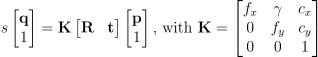,

where  are extrinsic parameters with rotation (parameterized as the angle-axis vector) and translation, and 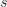 is an arbitrary scale factor.  is the camera intrinsic matrix with focal lengths  and principal points 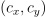 in pixel unit.  describes the skew of the two image axes which can be assumed zero for most modern cameras[[1]](#szeliski2010computer). 

The lens distortions are modeled using the coefficients  for radial and  for tangential distortions following the widely used lens model[[1]](#szeliski2010computer) relating a distorted image point 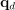 and undistorted image point  by:

As a result, each camera is modeled with 15 parameters
(6 extrinsics, 4 intrinsics, and 5 lens distortion parameters).

<h2 id="bundle-adjustment">Bundle adjustment with planar checkboard</h2>

---
We denote the positions of checkerboard corners w.r.t. the body coordinate frame as a vectorized form ![$\bb{p}^b=[x_1, y_1, z_1, \dots, x_K, y_K, z_K]^T\in\mathbb{R}^{3K}$](./readme_assets/eq/chb_pts.jpg) where  is the number of corners on a checkerboard. To enforce the rigid planar assumption, we make  constant and set 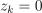. Then, a rigid body transformation 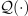 is applied to each corner to obtain their world positions . The transformation is parameterized by the angle-axis vector  for rotation and translation vector 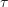:

,

where  computes a rotation matrix using Rodrigues' formula, and  denotes position of 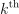 corner in .

Using this planar model, we minimize the following sum of mean reprojection errors over all frames:

where 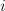 is frame index,  is camera index with 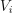 encoding visibility information, 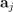 is a vector of 15 parameters of camera ,  is the pose of the checkerboard,  are the vectorized positions of observed corners, 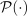 projects each of the  world points  onto camera's image plane, and 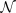 is for averaging.

<h2 id="vae">VAE outlier corner detection</h2>

---

We treat incorrectly or inaccurately detected corners as
outliers and identify them using VAE.

<h3 id="vae-objective">Objective of VAE</h3>

VAE deals with an unknown underlying probabilistic distribution  defined over the data points 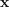 in some potentially high-dimensional space 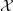[[2]](#kingma2013auto). The aim of VAE is to approximate the underlying distribution with a chosen model 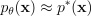, parameterized by  and marginalized over the latent variables :

.

The objective is to estimate the parameters  via Maximum Likelihood Estimation (MLE) on the likelihood of the data set  consisting of i.i.d. samples 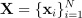. Using variational inference for approximating the intractable true posterior  involved in  with some tractable distribution 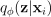, then it is sufficient for MLE to maximize the evidence lower bound :

,

where  is Kullback-Leibler (KL) divergence[[3]](#murphy2012machine).

To make the maximization of the evidence lower bound tractable, the prior  is set as isotropic unit Gaussian and the posterior  as Gaussians 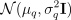. Also, this parameterization allows the use of the *reparameterization trick* to make the random sampling of 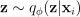 in  differentiable w.r.t. 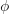 by reparameterizing it as , with 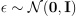. Moreover, by choosing  where  is pre-determined and after collecting constant terms into , maximizing  becomes equivalent to minimizing:

For VAEs,  refers to a probabilistic *encoder* and  to a probabilistic *decoder*.

<h3 id="vae-architecture">VAE architecture</h3>

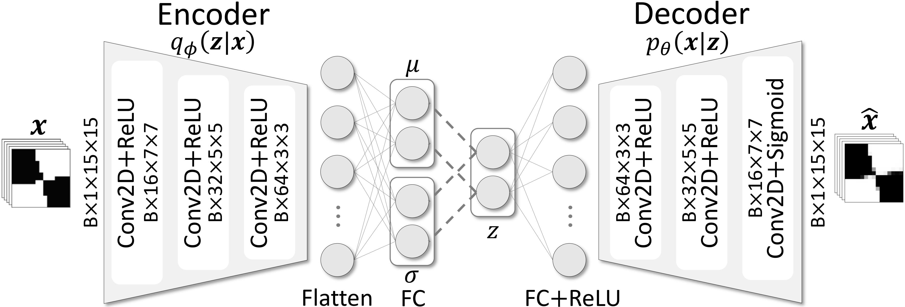

For input images, we first remove shading information through binarization using Otsu's method following Gaussian blurring. The last layer in the decoder is a sigmoid activation which returns pixel values in range [0,1].

<h2 id="experimental">Experimental results</h2>

---

<h3 id="vae-effects">Effects of corner outliers on the calibration accuracy</h3>

<figure>
    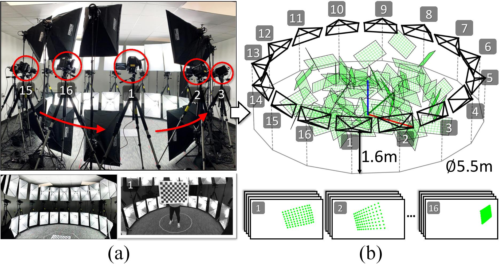
    <figcaption>Figure 1: (a) 16 camera studio setup and (b) its virtual counterpart with a randomly moving checkerboard visualized.</figcaption>
</figure>

We generate four sets of synthetic image points of a virtual planar checkerboard ([Figure 1](#studio-setup)). We include different percentages of outlier corners (0%, 0.01%, 0.1%, and 1%) in each image set where each outlier corner is randomly offset from its ground-truth location by 10-15 pixels. Then, we estimate the parameters of 16 cameras using each of the four image sets and compare the root mean square error (RMSE) between the ground-truth.

<figure>
    ,
    <figcaption>Figure 2: RMSE comparisons of estimated camera parameters, grouped by percentages of outlier corners.</figcaption>
</figure>

The result is obtained as in [Figure 2](#rmse), where the geodesic distance on unit sphere is used for computing the error in camera orientations 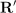, and  denotes camera position. Since each calibration is obtained in an arbitrary coordinates system, we align them with the reference coordinates using Procrustes analysis before computing RMSE.

<h3 id="vae-performance">Performance evaluations</h3>

<h4 id="performance-synth">Synthetic experiment</h4>

We generate 10k synthetic corner images with 1% outliers by cropping 15x15 pixels from the template corner after applying random affine transformations:

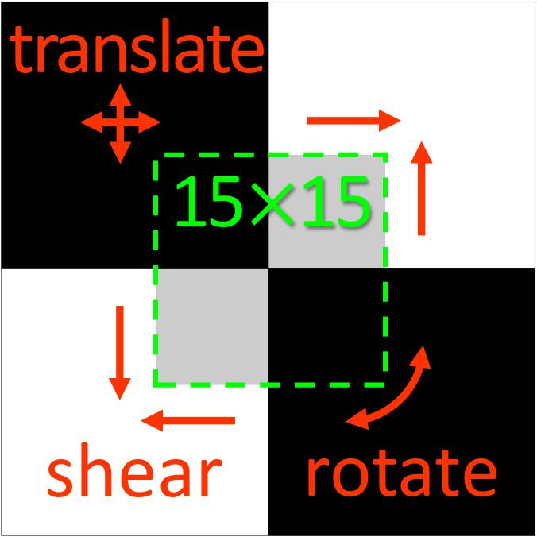

The outlier corners are offset from the center of crop by 2-4 pixels ([Figure 3b](#synth-crops)).

We set the latent space of VAE and AE to 2 dimensional, and VAE's KL divergence weight to =1. Then, VAE and AE are trained for 1k epochs using Adam optimizer with learning rate 1e-3. For PCA and kPCA (with a Gaussian kernel), we use 2 principal axes for reconstructions.

We use the same binarized inputs for both training and testing ([Figure 3](#synth-crops)) and compare the results using the area under the receiver operator characteristic curve (AUROC) and the precision recall curve (AUPRC). Note, when the data for binary classification is heavily imbalanced, AUPRC can be less misleading than AUROC[[4]](#davis2006relationship).

<figure>
    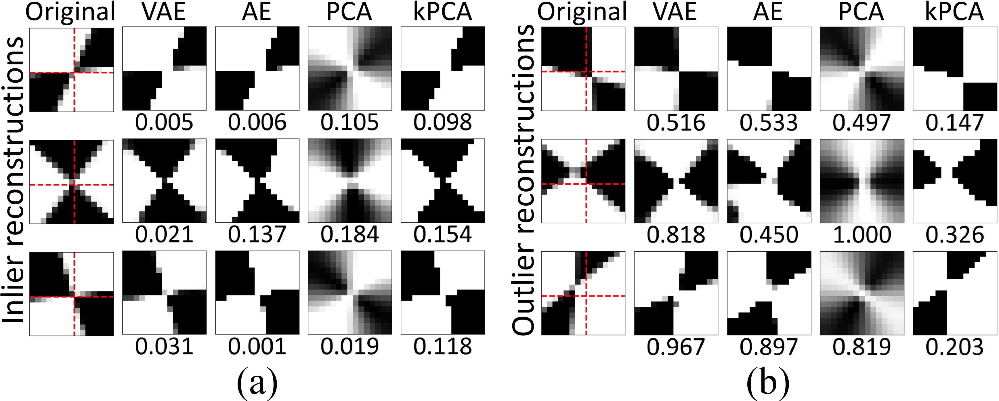
    <figcaption>Figure 3: Reconstructions and normalized losses of synthetic corners: (a) inliers and (b) outliers.</figcaption>
</figure>

From [Figure 4](#auroc-auprc), we observe AUPRC of VAE is the largest, outperforming the rest. For VAE, the precision ratio remains very close to 1 even as the recall ratio approaches 1, implying VAE can remove outliers without also removing the inliers.

<figure>
    
    <figcaption>Figure 4: Area under the receiver operator characteristic curve (AUROC) and the precision recall curve (AUPRC).</figcaption>
</figure>

The performance differences are more pronounced in the normalized reconstruction losses plot of every data points in [Figure 5](#recon-loss). In contrast to AE, PCA, and kPCA, a clear classification margin is achieved by VAE which implies the outliers can be identified with high confidence.

<figure>
    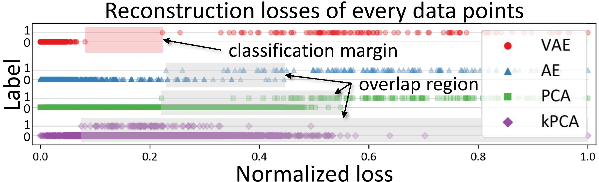
    <figcaption>Figure 5: Normalized reconstruction losses of every corner crops by VAE, AE, PCA, and kPCA.</figcaption>
</figure>

<h4 id="performance-real">Real experiment</h4>

We capture images (~172 frames per camera) of a freely moving checkerboard and crop 15x15 pixels centered at detected corners. Similarly, we train VAE with heuristically determined KL divergence weight =0.01 for 200 epochs.

<figure>
    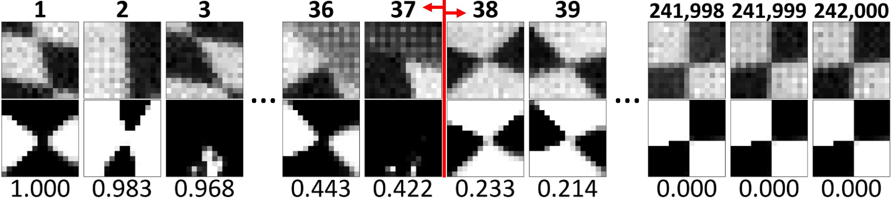
    <figcaption>Figure 6: Original grayscale crops (above) and VAE reconstructions (below) sorted by normalized losses.</figcaption>
</figure>

<figure>
    
    <figcaption>Figure 7: Normalized VAE reconstruction losses of every corner crops displaying distinct classification margin.</figcaption>
</figure>

The result in [Figure 6](#recons-real) shows that the outlier corners are reconstructed with large loss, and via visual inspection 37 outliers can be identified (~ 0.015% outliers). Similar to [Figure 5](#recon-loss), a clear classification margin can be observed in the reconstruction loss plot in [Figure 7](#recon-loss-real). Utilizing these, we can determine the outlier corners with high confidence from tens to thousands of images.

<h2 id="references">References</h2>

---
<a id="szeliski2010computer">[1]</a> Szeliski R. Computer vision: algorithms and applications. Springer Science & Business Media; 2010 Sep 30.

<a id="kingma2013auto">[2]</a> Kingma DP, Welling M. Auto-encoding variational bayes. arXiv preprint arXiv:1312.6114. 2013 Dec 20.

<a id="murphy2012machine">[3]</a> Murphy KP. Machine learning: a probabilistic perspective. MIT press; 2012 Sep 7.

<a id="davis2006relationship">[4]</a> Davis J, Goadrich M. The relationship between Precision-Recall and ROC curves. InProceedings of the 23rd international conference on Machine learning 2006 Jun 25 (pp. 233-240).

