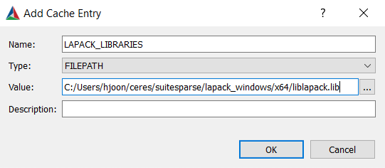

# Ceres installation - Windows 10 x64
Install [CMake](https://cmake.org/) (3.5 or later) if you haven't.
## 1. Make directories following the [official guide](http://ceres-solver.org/installation.html).

    {root}/ceres
    
<b>For my PC, `{root}` is `C:/users/hjoon`.</b> Note, if `{root}` is too long, compiling `suitesparse` gives errors related to path lengths.

## 2. Prepare [Eigen](http://eigen.tuxfamily.org/index.php?title=Main_Page) (3.3 and later)

### a. Download

    cd "{root}\ceres"
    git clone https://gitlab.com/libeigen/eigen.git

### b. Configure and build

We need Eigen3 for Ceres.

    cd "{root}\ceres\eigen"
    mkdir build
    cd build
    cmake ..

You should be see `Eigen3Config.cmake` inside `eigen/build`.

## 3. Prepare [glog](https://github.com/google/glog) (0.3.1 or later)

#### a. Download

    cd "{root}\ceres"
    git clone https://github.com/google/glog.git

#### b. Configure and build

In `{root}\ceres\glog\CMakeList.txt` line 20, make sure `BUILD_SHARED_LIBS` is set to `ON` (default) to generate `.dll`.

    option (BUILD_SHARED_LIBS "Build shared libraries" ON)

Set output directory by adding the following in `{root}\ceres\glog\CMakeList.txt` (e.g., line 13).

    set (CMAKE_INSTALL_PREFIX "{root}/ceres/glog/install")

Build:

    cd "{root}\ceres\glog"
    mkdir build
    cd build
    cmake ..

#### c. Install
- Open Visual Studio (2019) **as administrator** and open the project: `build\glog.sln`
- Set to *Release x64*, and build `ALL_BUILD` then `INSTALL`

  - This should generate `include`, `lib`, and `bin` folders inside: `{root}\ceres\glog\install`
  

# 4. Prepare [gflags](https://github.com/gflags/gflags)

### a. Download

    cd "{root}\ceres"
    git clone https://github.com/gflags/gflags.git

### b. Configure and build

Set output directory by adding the following in `{root}\ceres\gflags\CMakeList.txt` (e.g., line 417).

    set (CMAKE_INSTALL_PREFIX "{root}/ceres/gflags/install")

Build:

    cd "{root}\ceres\gflags"
    mkdir gflags-build
    cd gflags-build
    cmake ..

#### c. Install

- Open Visual Studio (2019) **as administrator** and open the project: `gflags-build\gflags.sln`
- Set to *Release x64*, and build `ALL_BUILD` then `INSTALL`
  - This should generate `include`, `lib` folders inside: `{root}\ceres\gflags\install`

# 5. Prepare [SuiteSparse](https://github.com/jlblancoc/suitesparse-metis-for-windows)

According to: https://www.jianshu.com/p/736e89aaf788, 
    
<i>This is not a dependent library that must be installed. However, if installed, it will improve the computational performance of Ceres for sparse matrices, and provide more available optimization algorithms. So although the installation process of Ceres will be more complicated after adding this library, it is still recommended to install. </i>

### a. Download

    cd "{root}\ceres"
    git clone https://github.com/jlblancoc/suitesparse-metis-for-windows.git

Rename the folder name for convenience:

    move .\suitesparse-metis-for-windows\ .\suitesparse

### b. Configure and build

Change output directory in `{root}\ceres\suitesparse\CMakeList.txt` line 47, from:

    set(CMAKE_INSTALL_PREFIX "${${PROJECT_NAME}_BINARY_DIR}/install" CACHE PATH "Prefix prepended to install directories" FORCE)

to:

    set(CMAKE_INSTALL_PREFIX "${${PROJECT_NAME}_BINARY_DIR}/../install" CACHE PATH "Prefix prepended to install directories" FORCE)

Build:

    cd "{root}\ceres\suitesparse"
    mkdir build
    cd build
    cmake ..

### c. Install

- Open Visual Studio (2019) **as administrator** and open the project: `build\SuiteSparseProject.sln`
- Set to *Release x64*, and build `ALL_BUILD` then `INSTALL`
  - This should generate `include`, `lib` folders inside: `{root}\ceres\suitesparse\install`

# 6. Build [Ceres](http://ceres.org/installation.html)

### a. Download

    cd "{root}\ceres"
    git clone https://ceres-solver.googlesource.com/ceres-solver

### b. Configure and build

- Open CMake GUI
    - Set input source code to `{root}/ceres/ceres-solver`
    - Set output build directory to `{root}/ceres/ceres-solver/ceres-build`

<!---->

  - Click `Configure`, choose generator `Visual Studio 16 2019`, set platform to `x64`, then click `Finish`. This will initially generate many errors.

<!---->
  
  - Set output directory by setting `CMAKE_INSTALL_PREFIX` to `{root}\ceres\ceres-install`

<!---->

  - Uncheck `BUILD_EXAMPLES` and `BUILD_TESTING`

<!---->

  - Click `Add Entry`, and add `SUITESPARSE_CHECK_INCLUDE_DIRS` as `PATH` to `{root}/ceres/suitesparse/install/include`

<!---->

  - Click `Add Entry`, and add `SUITESPARSE_CHECK_LIBRARY_DIRS` as `PATH` to `{root}/ceres/suitesparse/install/lib`

<!---->

  - Check `SUITESPARSE` and `LAPACK`

<!---->

  - Click `Add Entry`, and add `BLAS_LIBRARIES` as `FILEPATH` to `{root}/ceres/suitesparse/lapack_windows/x64/libblas.lib`

<!---->

  - Click `Add Entry`, and add `LAPACK_LIBRARIES` as `FILEPATH` to `{root}/ceres/suitesparse/lapack_windows/x64/liblapack.lib`

<!---->

  - Set `Eigen3_DIR` to `{root}/ceres/eigen/build` (where `Eigen3Config.cmake` is located)

<!---->

  - Click `Configure` again then `Generate`.

### c. Install

- Open Visual Studio (2019) **as administrator** and open the project: `ceres-build\Ceres.sln`
- Set to *Release x64*, and build `ALL_BUILD` then `INSTALL`. This should take several minutes.
    - This should generate `include`, `lib`, and `CMake` folders inside: `{root}\ceres\ceres-install`