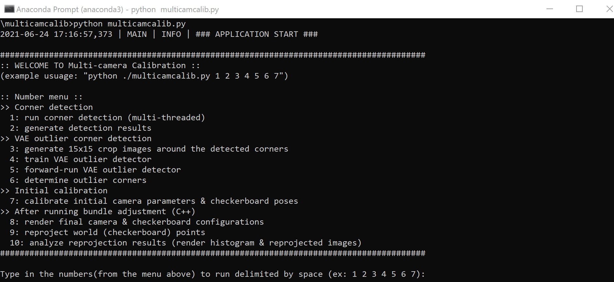
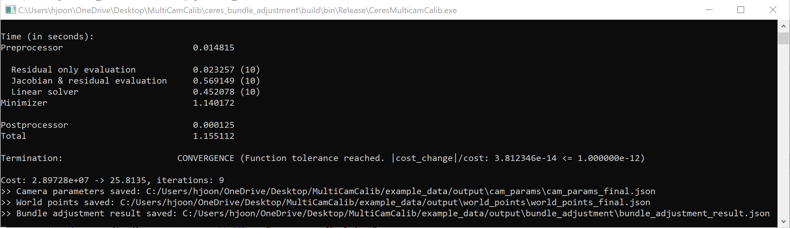
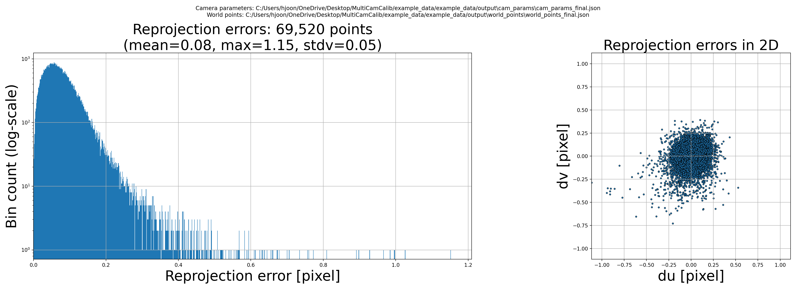
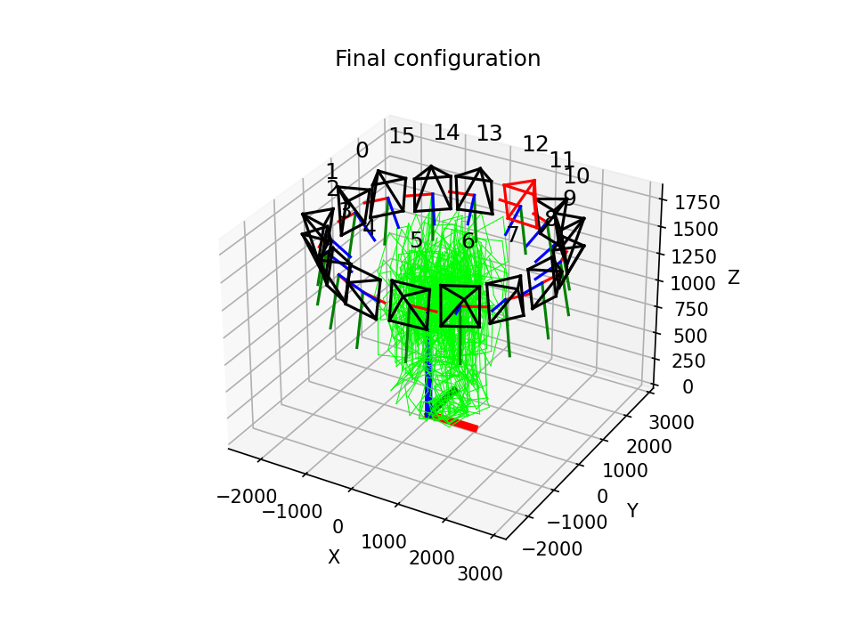
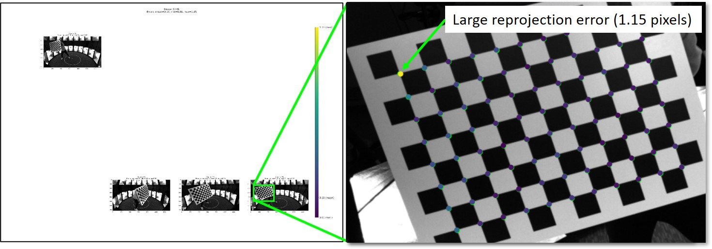

<h1>Example (step-by-step tutorial)</h1>

An example dataset can be found inside *"/example_data/"* folder:

    {YOUR_ROOT}/
    +-- example_data
    |   +-- images
    |   +-- image_paths.txt
    +-- ceres_bundle_adjustment # contains C/C++ codes
    +-- docs                    
    +-- multicamcalib           # contains python codes
    +-- readme.md
    +-- LICENSE

 The example images are captured from a studio comprised of 16 synchronized inward-looking cameras positioned around a circle. Around 250 images are provided for each camera.

<figure>

</figure>

---

<h2>I. Prepare the input data</h2>

Two files must be modifed to suit your running environment: *"/example_data/images_paths.txt"* and *"/mlticamcalib/config.json"*.

First, modify the file *"/example_data/image_paths.txt"* which specifies input image paths in such format: 

    {CAMERA INDEX}|=|{PATH TO CORRESPONDING IMAGE}

Inside *image_paths.txt*,

    0|=|{YOUR_ROOT}\MultiCamCalib\example_data\images\cam_0\0_0000.png
    ...
    15|=|{YOUR_ROOT}\MultiCamCalib\example_data\images\cam_15\15_0250.png

Replace *{YOUR_ROOT}* with your own *absolute* directory of the project. For me, *{YOUR_ROOT}* is *C:\Users\hjoon\Desktop*,

    0|=|C:\Users\hjoon\Desktop\MultiCamCalib\example_data\images\cam_0\0_0000.png
    ...
    15|=|C:\Users\hjoon\Desktop\MultiCamCalib\example_data\images\cam_15\15_0250.png

---
Second, modify the two paths (*"abs_image_paths_file"* and *"abs_output_dir"*) inside *"/multicamcalib/config.json"*:

*config.json*:

    {
    "paths": {
        "abs_image_paths_file": "{YOUR_ROOT}/MultiCamCalib/example_data/image_paths.txt",
        "abs_output_dir": "{YOUR_ROOT}/MultiCamCalib/example_data/output",
        ...
    }

Again, replace *{YOUR_ROOT}* with your own *absolute* directory.

This *config.json* file contains all the parameters needed by the project. Each part will be explained throughout the tutorial, but for now you can leave everything else as it is.

---

***[IMPORTANT]*** **Directory structure and naming convention**

The example dataset are provides in the following structure and naming convention:

    /example_data/images/
    +-- cam_0
    |   +-- 0_0000.png
    |   ...
    |   +-- 0_0250.png
    .
    .
    .
    +-- cam_15
    |   +-- 15_0000.png
    |   ...
    |   +-- 15_0250.png

The input image folders **MUST** be organized in the following structure:

    .
    +-- cam_0
    |   +-- {image 0}
    |   +-- ...
    .
    .
    .
    +-- cam_N
    |   +-- {image 0}
    |   +-- ...

And the image names **MUST** follow this naming convention:

    {CAMERA INDEX}_{FRAME NUMBER}.{png/jpg/pgm/etc.}

Here, the frame numbers must contain the same number of characters. The names of the example images are chosen to contain four characters (ex: 0_0000.png, 0_0001.png, ..., 0_0250.png).

These are the only constraints required in this project.

---
<h2>II. Run!</h2>

**<h3>Steps (1)-(3)</h3>**
Open up a command prompt and navigate to *"{YOUR_ROOT}/MultiCamCalib/multicamcalib/"* where all the python codes reside and run *multicamcalib.py* with the installed Anaconda environment.

    cd "{YOUR_ROOT}/multicamcalib"
    conda activate {YOUR_ENV_NAME}
    python multicamcalib.py

A menu explaining each of the ten code numbers will pop up:

<figure>

</figure>

As explained in [2. Overview](../readme.md#s_overview), each step in the pipeline is executed by running corresponding *code numbers*, each delimited by a whitespace.

For this example dataset, everthing is configured accordingly inside */multicamcalib/config.json*. So all you have to type is *1 2 3 4 5 6 7*:

<figure>

</figure>

*Alternately,* you can skip the menu and specify the code numbers from the start by typing:

    python multicamcalib.py 1 2 3 4 5 6 7

The codes will execute the steps from [(1). Corner detection](../readme.md#step_1) to [(3). Initial camera calibration](../readme.md#step_3). This takes several minutes to finish.

* Once finished, the initial configuration is saved to *"{YOUR_ROOT}/example_data/world_points/intial_world_points.png*":

<figure>

<figcaption>Black: cameras; green: checkerboards in every frames; red: center camera and checkerboard to recenter the unconstrained origin of the world coordinate system.</figcaption>
</figure>

**<h3>Step (4)</h3>**
Once steps (1)-(3) have finished running, navigate to *"{YOUR_ROOT}/ceres_bundle_adjustment/build/bin/Release/"*. If you do not see this folder, that means you have not compiled *"CeresMulticamCalib.exe"* yet. Follow this tutorial before moving on.

Execute *"CeresMulticamCalib.exe", then bundle adjustment will run and save the refined camera parameters and world points. Once finished, you will see a prompt similar to:

<figure>

</figure>figcaption

Three files are saved as a result:
1. final camera parameters
2. final world points
3. bundle adjustment result summary

**<h3>Result analysis</h3>**
Navigate to *"{YOUR_ROOT}/multicamcalib/"* again, and run the code numbers 8, 9, and 10:

    python multicamcalib.py 8 9 10

This will compute the reprojection errors and save a histogram, the final configurations, and more (see here).

* The histogram of reprojection errors is saved to *"{YOUR_ROOT}/example_data/output/analysis/reproj_err_histograms.png*. It shows the mean reprojection error is 0.08 pixels.
<figure>

</figure>

* The final configuration is saved to *"{YOUR_ROOT}/example_data/world_points/final_world_points.png"*.
<figure>

</figure>

* Additionally, images with *>1 pixel* reprojection errors are saved to *"{YOUR_ROOT}/example_data/analysis/images/"*. Using these, you can inspect images with large reprojection errors.
<figure>

</figure>

---
<h2>1. Corner detection</h2>

The first step towards the calibration is to detect the checkerboard corners, if found, in each image.

Open up a command prompt and navigate to *{YOUR_ROOT}/MultiCamCalib/multicamcalib/* where all the python codes reside, and run *multicamcalib.py* with the installed Anaconda environment.

    cd "{YOUR_ROOT}"/multicamcalib
    conda activate camcalib
    python ./multicamcalib.py

The menu explaining each of the ten code numbers will pop up:

<figure>

</figure>

As explained in [2. Overview](../readme.md#s_overview), each step in the pipeline is executed by running corresponding *code numbers*, each delimited by a whitespace.

Code numbers 1 and 2 correspond to the corner detection step. So, run by typing *1 2*:

    Type in the numbers(from the menu above) to run delimited by space (ex: 1 2 3 4 5 6 7): 1 2

Then, corner detection will start which takes several minutes to finish:

<h2>2. VAE outlier detector</h2>
<h2>3. Initial camera calibration</h2>
<h2>4. Bundle adjustment</h2>
<h2>Analyze the result</h2>
