<h1>Tutorial (a step-by-step example)</h1>

An example dataset can be found inside *"/example_data/"* folder:

    {YOUR_ROOT}/
    +-- example_data
    |   +-- images
    |   +-- image_paths.txt
    |   +-- config.json         # a copy of it also exists in ./multicamcalib/
    +-- ceres_bundle_adjustment # contains C/C++ codes
    +-- docs                    
    +-- multicamcalib           # contains python codes
    +-- readme.md
    +-- LICENSE

 The example images are captured from a studio comprised of 16 synchronized inward-looking cameras positioned around a circle. Around 250 images are provided for each camera.

<figure>
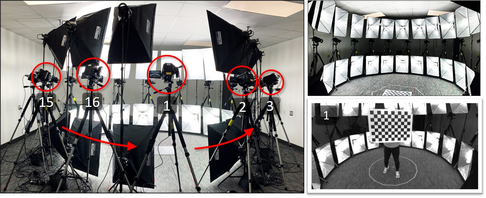
</figure>

---

<h2 id="s_input_data">I. Prepare input data</h2>

**Two** files must be modifed to suit your environment: *"/example_data/images_paths.txt"* and *"/mlticamcalib/config.json"*.

First, modify the file *"/example_data/image_paths.txt"* which specifies input image paths in this format:

    {CAMERA INDEX}<<>>{PATH TO CORRESPONDING IMAGE}

Here, "<<>>" is used as a delimiter. Inside *image_paths.txt*,

    0<<>>{YOUR_ROOT}\example_data\images\cam_0\0_0000.png
    ...
    15<<>>{YOUR_ROOT}\example_data\images\cam_15\15_0250.png

Replace *{YOUR_ROOT}* with your own *absolute* directory of the project. For me, *{YOUR_ROOT}* is *C:\Users\hjoon\Desktop\MultiCamCalib*,

    0<<>>C:\Users\hjoon\Desktop\MultiCamCalib\example_data\images\cam_0\0_0000.png
    ...
    15<<>>C:\Users\hjoon\Desktop\MultiCamCalib\example_data\images\cam_15\15_0250.png

---
Second, modify two paths (*"abs_image_paths_file"* and *"abs_output_dir"*) inside *"/multicamcalib/config.json"*. (A copy of this pre-configured *config.json* file is also located at *"/example_data/"*).

*config.json*:

    {
    "paths": {
        "abs_image_paths_file": "{YOUR_ROOT}/example_data/image_paths.txt",
        "abs_output_dir": "{YOUR_ROOT}/example_data/output",
        ...
    }

Again, replace *{YOUR_ROOT}* with your own *absolute* directory.

This *config.json* file contains all the parameters needed by the project. Each part is explained [here](#s_config), but for now you can leave everything else as it is.

---

***[IMPORTANT FOR OTHER DATASET]*** **Directory structure and naming convention**

The example dataset are provides in the following structure and naming convention:

    /example_data/images/
    +-- cam_0
    |   +-- 0_0000.png
    |   ...
    |   +-- 0_0250.png
    .
    .
    .
    +-- cam_15
    |   +-- 15_0000.png
    |   ...
    |   +-- 15_0250.png

The input image folders **MUST** be organized as the following structure:

    .
    +-- cam_0
    |   +-- {image 0}
    |   +-- ...
    .
    .
    .
    +-- cam_N
    |   +-- {image 0}
    |   +-- ...

And the image names **MUST** follow this naming convention:

    {CAMERA INDEX}_{FRAME NUMBER}.{png/jpg/pgm/etc.} // e.g., 2_000120.png for camera 2's 120-th image.

Here, the frame numbers must contain the same number of characters. The names of the example images are chosen to contain four characters (ex: 0_0000.png, 0_0001.png, ..., 0_0250.png).

These are the only constraints required in this project.

---
<h2 id="s_run">II. Run!</h2>

Open up a command prompt and navigate to *"{YOUR_ROOT}/multicamcalib/"* where all the python codes reside and run *multicamcalib.py* with the installed Anaconda environment.

    cd "{YOUR_ROOT}/multicamcalib"
    conda activate {YOUR_ENV_NAME}
    python multicamcalib.py

A menu explaining each of the ten code numbers will pop up:

<figure>
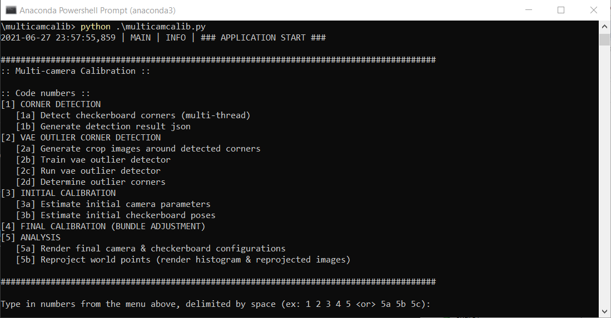
</figure>

As explained in [2. Overview](../readme.md#s_overview), each step in the pipeline is executed by running its corresponding *code number*, delimited by a whitespace. Inside */multicamcalib/config.json* contains all the configurations needed for the dataset, but for this example everything is already configured. So let's run through all the steps (type in *1 2 3 4 5*):

<figure>

</figure>

*Alternately,* you can skip the menu and specify the code numbers from the start by typing:

    python multicamcalib.py 1 2 3 4 5

or, (for example) if you wish to run only the corner detection part, run *1a*:

    python multicamcalib.py 1a
    
or, you can run more specificially like this:

    python multicamcalib.py 2b 2c 2d 4 5b

The codes will execute all the steps from [(1). Corner detection](../readme.md#step_1) to [(5). Analyze the calibration result](../readme.md#step_5). This takes several minutes to finish.

**Once finished, the following results are saved:**

* Initial/final camera configurations *"{YOUR_ROOT}/example_data/output/cam_params/"*:

<figure style="display:inline-block; display:block;">
    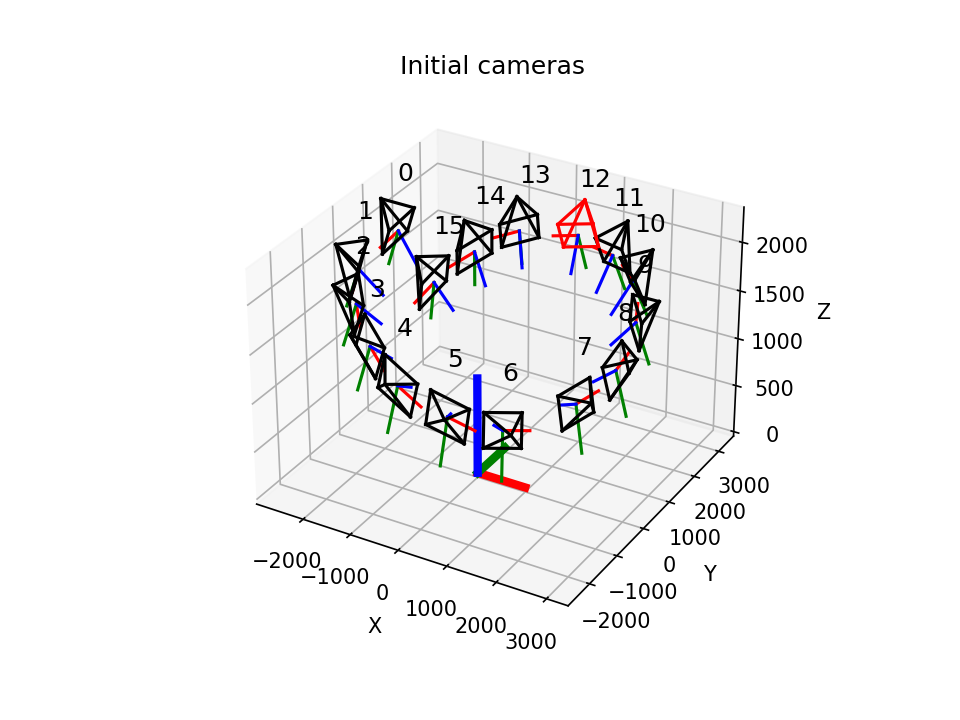
    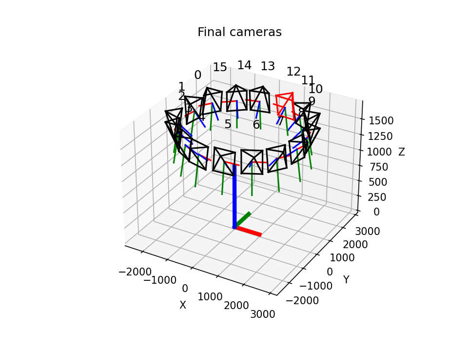
</figure>

* Initial/final camera configurations with the estimated checkerboard points *"{YOUR_ROOT}/example_data/output/world_points/"*:

<figure style="display:inline-block; display:block;">
    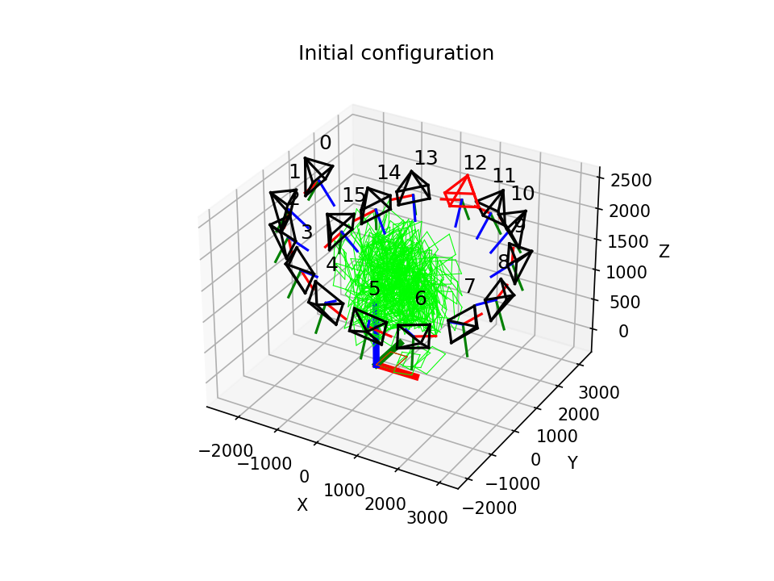
    
</figure>

* Images with large reprojection errors *"{YOUR_ROOT}/example_data/output/analysis/images/"*:
<figure style="display:inline-block; display:block;" id="fig_reprojerrors">
    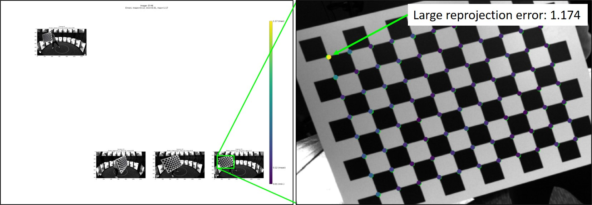
</figure>

* Reprojection error historgram *"{YOUR_ROOT}/example_data/output/analysis/"*:
<figure style="display:inline-block; display:block;" id="fig_histogram">
    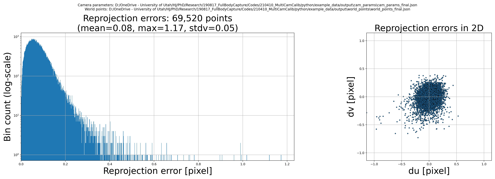
</figure>

* VAE corner detector  
  * train loss plot *"{YOUR_ROOT}/example_data/output/vae_outlier_detector/train_loss_plot.png"*:
    <figure style="display:inline-block; display:block;" id="fig_histogram">
        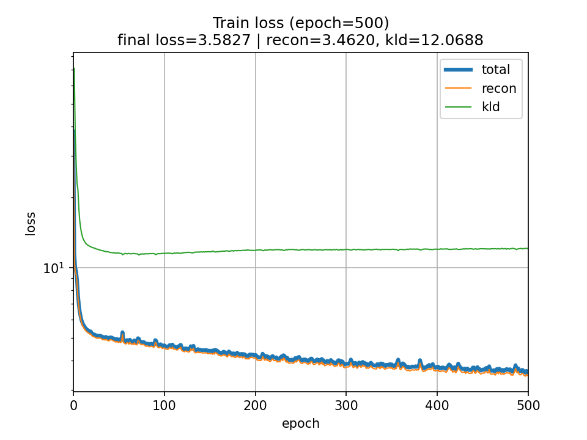
    </figure>

  * outlier corners and their reconstructions *"{YOUR_ROOT}/example_data/output/vae_outlier_detector/outliers/"*:
    <figure style="display:inline-block; display:block;" id="fig_histogram">
        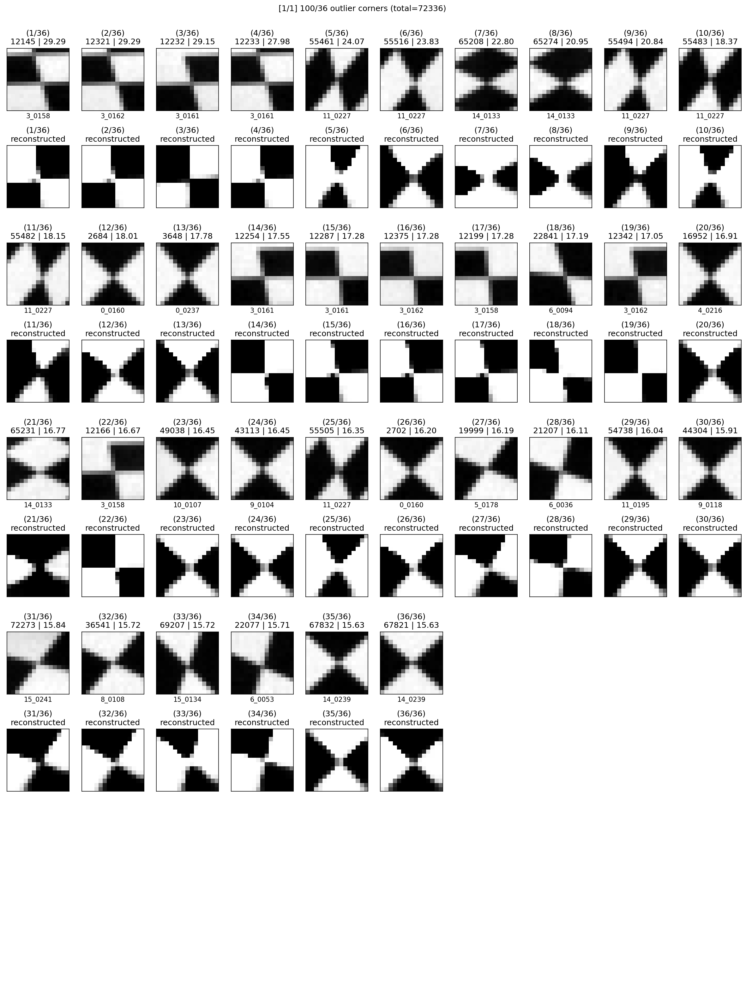
    </figure>

**<h3>Note on step ***[4] FINAL CALIBRATION (BUNDLE ADJUSTMENT)***</h3>**
Running code number 4 executes *"{YOUR_ROOT}/ceres_bundle_adjustment/build/bin/Release/CeresMulticamCalib.exe"*. If you do not see this folder, that means you have not compiled *"CeresMulticamCalib.exe"* yet. Follow [this tutorial](compile_project.md) before moving on.

---
<h2 id="s_config">III. config.json</h2>

This section explains the parameters defined inside *"{YOUR_ROOT}/multicamcalib/config.json"*.

***paths***

    "paths": {
        "abs_image_paths_file": "{YOUR_ROOT}/example_data/image_paths.txt",
        "abs_output_dir": "{YOUR_ROOT}/example_data/output",
        "logs": "logs",
        "corners": "corners",
        "vae_outlier_detector": "vae_outlier_detector",
        "corner_crops": "vae_outlier_detector/corner_crops",
        "outliers": "vae_outlier_detector/outliers",
        "cam_params": "cam_params",
        "world_points": "world_points",
        "ceres_output": "bundle_adjustment",
        "analysis": "analysis"
    },

As mentioned before, *"abs_image_paths_file"* and *"abs_output_dir"* must be *absolute* paths. 

* *abs_image_paths_file*: absolute path to a .txt file specifiying input image paths (mentioned [here](#s_input_data)).
* *abs_output_dir*: absolute directory where all the output data will be saved.
* *logs*, *corners*, ..., *analysis*: the output folder names saved to *abs_output_dir*. You don't need to change them unless different folder names are desired.

***checkerboard***

    "checkerboard": {
        "n_cols": 11,
        "n_rows": 8,
        "sqr_size": 60
    },

Dimension of a planar calibration chekerboard. For the provided example dataset, the calibration checkerboard has 8 rows and 11 columns with the square size 60 mm. Note, the square size is in *milimeters*.

<figure style="display:inline-block; display:block;">
    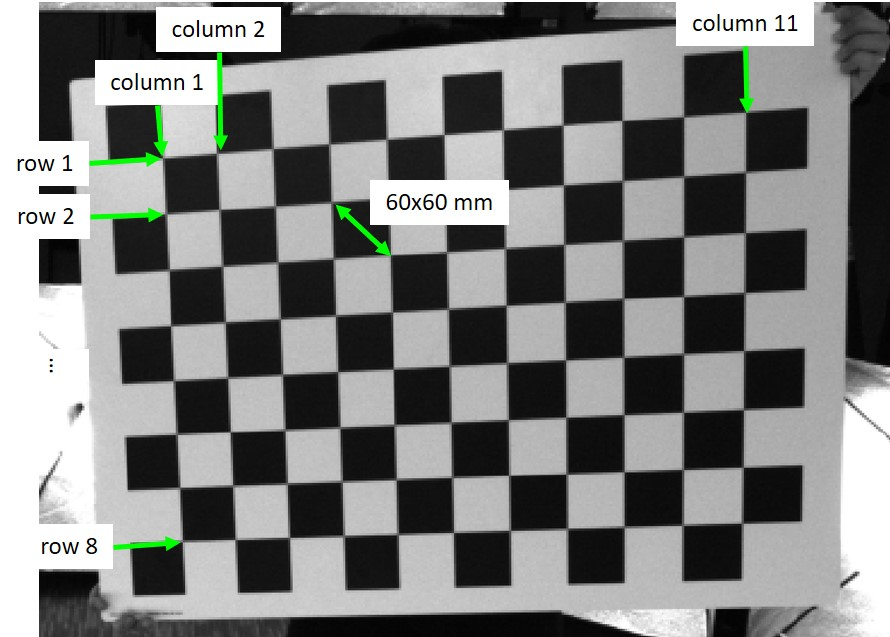
</figure>

***cameras***

    "cameras": {
        "n_cams": 16
    },

The number of cameras (a natural number).

***vae_outlier_detector***

    "vae_outlier_detector": {
        "z_dim": 2,
        "kl_weight": 0.01,
        "n_epochs": 500,
        "lr": 0.001,
        "batch_size": 1000,
        "outlier_thres_ratio": 0.0005
    },

For details on VAE outlier detector, see *3. VAE outlier corner detection* in [here](details.md#s_vae). These parameters are determined heuristically.

* *z_dim*: dimensions of the latent space *z*

<figure style="display:inline-block; display:block;">
    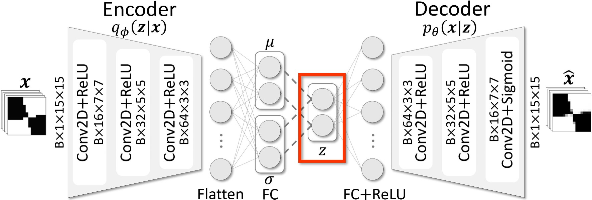
    <figcaption>VAE architecture</figcaption>
</figure>

* *kl_weight*: weight  on the KL-divergence term  defined in the following loss

<figure style="display:inline-block; display:block;">
    
</figure>

* *n_epochs*: number of epochs to train the VAE outlier detector.
* *lr*: learning rate.
* *batch_size*: number of corner crops for each batch during training.
* *outlier_thres_ratio*: at which fraction the outlier corners should be given sorted reconstruction losses. For example, *0.0005* means "corner crops with the top 0.05% largest reconstruction errors are treated as outliers and will be unused during the calibration".

***calib_initial***

    "calib_initial": {
        "center_cam_idx": 12,
        "center_img_name": "0000",
        "intrinsics": {
            "n_max_imgs": 40
        },
        "extrinsics": {
            "n_max_stereo_imgs": 3
        }
    },

* *center_cam_idx*, *center_img_name*: Bundle adjustment results in an arbitrary coordinates system. Therefore, choose a camera and a frame in which the origin of the coordinates system should be defined. For example, *"center_cam_idx": 12, "center_img_name": "0000"* is this frame:

<figure style="display:inline-block; display:block;">
    
    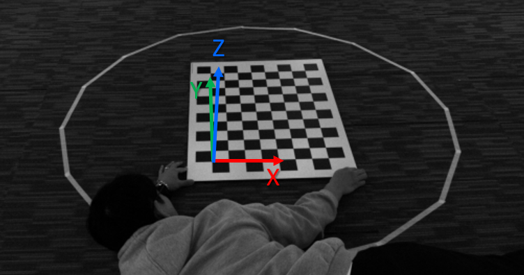
    <figcaption>Camera 12's 0-th frame is used to define the origin of a coordiates system.</figcaption>
</figure>

This center camera and checkerboard is colored *red* when the camera configuration and world points are rendered:

<figure style="display:inline-block; display:block;">
    
    
</figure>

* *intrinsics* - *n_max_imgs*: number of images to use when calibrating intrinsics parameters of each camera using *cv2.calibrateCamera()*.
* *extrinsics* - *n_max_stereo_imgs*: number of images to use when stereo-calibrating two cameras using *cv2.stereoCalibrate()*.

***bundle_adjustment***

    "bundle_adjustment": {
        "max_iter": 1000,
        "num_thread": 4,
        "lens_coeffs_reg_weight": 0.1,
        "function_tolerance": 1e-12,
        "parameter_tolerance": 1e-12,
        "gradient_tolerance": 1e-12,
        "inner_iteration_tolerance": 1e-12
    },

* *max_iter*: maximum number of iterations for solving non-linear least squares using Levenberg-Marquardt algorithm.
* *num_thread*: number of threads used by Ceres to evaluate the Jacobian.
* *lens_coeffs_reg_weight*: the regularization weight  in the loss term for bundle adjustment defined as 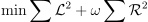, where 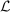 represents reprojection error, and 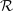 represents regularization terms on the lens distortion coefficients of every camera (i.e., 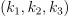, ).
* *function_tolerance*, *parameter_tolerance*, *gradient_tolerance*, *inner_iteration_tolerance*: termination conditions of the Levenberg-Marquardt algorithm (see [here](http://ceres-solver.org/nnls_solving.html?highlight=tolerance#_CPPv4N5ceres6Solver7OptionsE) for more details).

***analysis***

    "analysis": {
        "save_reproj_err_histogram": 1,
        "save_reproj_images": 1,
        "error_thres": 1
    }

* *save_reproj_err_histogram*: 0/1 - save a reprojection histogram like [this](#fig_histogram).

* *save_reproj_images*: 0/1 - save plots showing captured input images, detected checkerboard corners, and reconstructed checkerboard corners like [this](#fig_reprojerrors).

* *error_thres*: float value - save reprojection images (*save_reproj_images*) that have the maximum reprojection error above *this value*.
