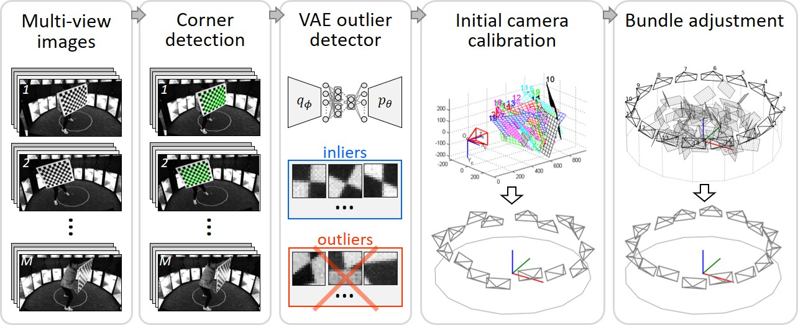

##### Table of Contents  
[Introduction](#h1)  
[Installation](#emphasis)  

<h2 id="h1">1. Introduction</h2>

---
This project calibrates multiple cameras using *VAE outlier corner detection* and *bundle adjustment* employing a planar calibration checkerboard.
The steps are as followed.

(1). **Multi-view images**: The input is a set of images capturing a freely moving checkerboard.

(2). **Corner detection**: Checkerboard corners are detected and localized with sub-pixel precision using OpenCV.

(3). **VAE outlier detector**: Outlier corners are identified using VAE (variational auto-encoder), and corresponding images are discarded.

(4). **Initial camera calibration**: Initial camera parameters (and frame-wise checkerboard poses) are estimated from a subset of images using Zhang's method[[1]](#zhang2000flexible).

(5). **Bundle adjustment**: The camera parameters (and frame-wise checkerboard poses) are further refined using bundle adjustment.

<h2 id="h2">2. Visual demonstration</h2>

---

<h2 id="h3">3. Installation</h2>

---

(1) Download the project

    git clone https://github.com/hjoonpark/MultiCamCalib.git

(2) 

### Ceres installation
#### 1. [Windows](docs/install_windows.md)
#### 2. [Linux](docs/install_linux.md) (coming)

<h2 id="h4">4. Academical details</h2>

----
[[Link]](docs/details.md)

<h2 id="h5">References</h2>

---

<a id="zhang2000flexible">[1]</a> 
Zhang Z. A flexible new technique for camera calibration. IEEE Transactions on pattern analysis and machine intelligence. 2000 Nov;22(11):1330-4.