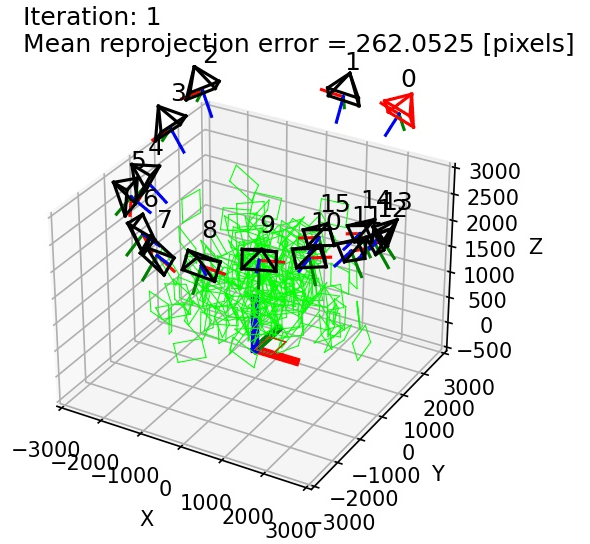
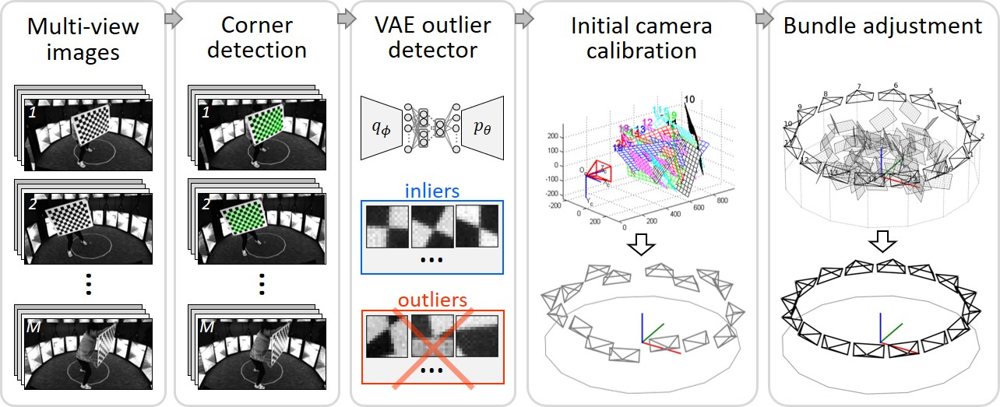

<h1>Table of Contents</h1>

1. [Introduction](#s_intro)  
2. [Overview](#s_overview)  
3. [Installation](#s_installation)
4. [Tutorial](#s_example)
5. [Academical details](#s_details)
6. [Contact](#s_contact)

<h2 id="s_intro">1. Introduction</h2>

This project calibrates multiple cameras using a planar calibration checkerboard. The pipeline is comprised of *four* main steps: [(1)](#step_1) detect checkerboard corners, [(2)](#step_2) remove outlier corners from the previous step (using *VAE, variational auto-encoder*), [(3)](#step_3) estimate initial camera parameters and world (checkerboard) points, [(4)](#step_4) refine the initial estimates (using *bundle adjustment*), then *optionally* [(5)](#step_5) analyze the calibration result.

<figcaption> Left: 16 synchronized cameras. Right: Bundle adjustment in action.</figcaption>

 

* This project is focused on being simple and scalable, applicable to different calibration checkerboards and different number of cameras.
* The steps (1)-(3)/(5) are implemented using *python 3* and the step (4) using *C/C++*.
* On the example dataset provided (./example_data/), this project achieves *mean reprojection error 0.08 pixels* with standard deviation 0.05.

<h2 id="s_overview">2. Overview</h2>

The code execution follows the pipeline below:

*(Input)* (0). **Multi-view images**: The input is a set of images capturing a freely moving checkerboard.

<label id="step_1">(1)</label>. **Corner detection**: Checkerboard corners are detected and localized with sub-pixel precision using [OpenCV](https://docs.opencv.org/master/dc/dbb/tutorial_py_calibration.html).

<label id="step_2">(2)</label>. **VAE outlier detector**: Outlier corners are identified using VAE (variational auto-encoder), and corresponding images are discarded. As expained [here](./docs/details.md#s_vae) (Section 3), open-source corner detectors (e.g., OpenCV, MATLAB, etc.) are known to give incorrect or inaccurate (i.e., outlier) corners which may deteriorate the accuracy of camera caibration. Therefore, we identify and remove such outliers by tranining a VAE outlier detector. Its effectiveness is explored more [here](./docs/details.md#experimental) (Section 4).

<label id="step_3">(3)</label>. **Initial camera calibration**: Initial camera parameters and frame-wise checkerboard poses are first estimated from a subset of images using OpenCV.

<label id="step_4">(4)</label>. **Bundle adjustment**: The estimated camera parameters and frame-wise checkerboard poses are further refined using bundle adjustment.

*(Optional)* <label id="step_5">(5)</label>. **Analyze the calibration result**: Computes reprojection errors and render corresponding histogram, reprojected images, etc. for analysis.

<h2 id="s_installation">3. Installation</h2>

(1) Download the project. In a command prompt (Windows) or terminal (Linux):

    git clone https://github.com/hjoonpark/MultiCamCalib.git

<label id="install_ceres">(2)</label> Install Ceres
* Click [here](docs/install_windows.md) for **Windows**
* Click here for **Linux** (coming)

(3) Build the bundle adjustment project (C/C++)

* Click [here](docs/compile_project.md)

(4) Create Anaconda environment for Python

1. Windows

    Assuming [Anaconda](https://docs.anaconda.com/anaconda/install/windows/) is already installed, navigate to *./MultiCamCalib/* where *environment.yml* exists. Then in a Anaconda Powershell Prompt:

        conda env create --file environment.yml

2. Linux (*coming...*)

(5) Run the codes → Follow [this tutorial](docs/tutorial.md)!

<h2 id="s_example">4. Tutorial</h2>

Follow [this quick start tutorial (a step-by-step example)](docs/tutorial.md)

<h2 id="s_details">5. Academical details</h2>

Click [here](docs/details.md)

<h2 id="s_contact">6. Contact</h2>

For questions, please contact hjoonpark.us@gmail.com.